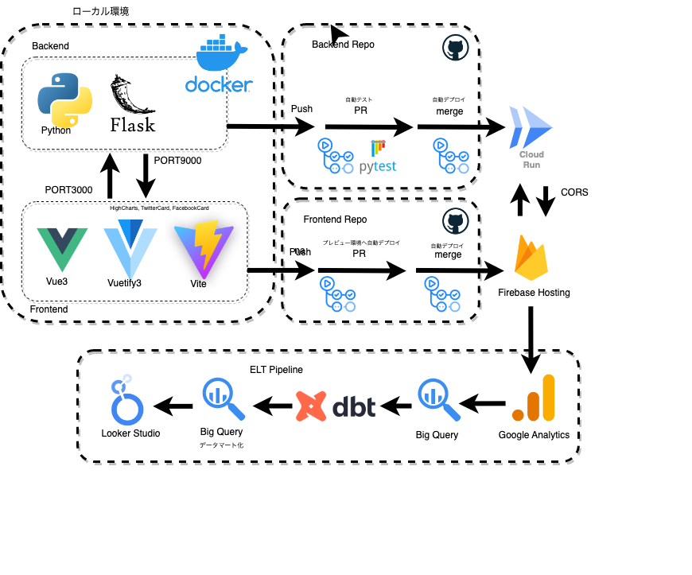

## asset-management-simulation-backend
- 自作のWebAppである資産管理シミュレーションのバックエンドに関するレポジトリです。
- フロントエンドのレポジトリは [こちら](https://github.com/spider-man-tm/asset-management-simulation-frontend)をご参照ください。



### Overview
- WebフレームワークはFlaskを使用しています。
- デプロイ先は Google Cloud Runです。
- main branchへのPRが発行されたタイミングで、GitHub Actionsを利用した自動テスト(pytest)が実施されます。
- main branchへpush、あるいはPRがマージされたタイミングでGitHub Actionsを利用したCloud Runへの自動デプロイが実施されます。

### Usage
#### ローカル開発
- 準備
  - Makefile.devなどを用意し、以下のようにGCPのプロジェクトIDと任意のイメージ名、およびタグ名を記述
  - Makefileを読み込む必要があるため、`include Makefile`も合わせて記述
```
PROJECT_ID := xxx
IMAGE := xxx
TAG := xxx

include Makefile
```

- Dockerコンテナを起動する場合
``` shell
# ビルド
make build -f Makefile.dev
# ローカルでコンテナ起動
make run-local -f Makefile.dev
# まとめてやる場合
make build run-local -f Makefile.dev
```

- poetryで直接`.venv`を作成する場合
``` shell
make install
```

- ローカルで`.venv`環境を使ったpytestを実行する場合
``` shell
make test-local
```

#### 手動デプロイ
- Makefile.prdなどを用意する。あとは以下のコマンドでdeployまで行う
- デプロイ時に`FRONTEND_URL_hoge`や`PREVIEW_FRONTEND_URL`を環境変数として渡す必要があるのでMakefile.prdで事前に定義する
```
PROJECT_ID := xxx
IMAGE := xxx
TAG := xxx

PREVIEW_FRONTEND_URL := xxx
FRONTEND_URL_1 := xxx
FRONTEND_URL_2 := xxx
FRONTEND_URL_3 := xxx

include Makefile
```

``` shell
# ビルド
make build -f Makefile.prd
# イメージをpush
make push -f Makefile.prd
# Cloud runにデプロイ
make deploy -f Makefile.prd
# まとめてやる場合
make build push deploy -f Makefile.prd
```

#### CI/CD
- GCP上に新規サービスアカウントを以下のロールを付与した状態で作成
  - ストレージ管理者
  - Cloud Run 管理者
  - サービスアカウントユーザー
- 以下のスクリプトを実行
  - サービスアカウントで発行されたjson鍵を使う認証は非推奨のため、workload-identityを使用
  - 実行後、workload_identity_providerが表示されるが、後工程で必要
``` shell
PROJECT_ID=xxx
SERVICE_ACCOUNT_NAME=xxx   # 上記で作成したサービスアカウント
POOL_NAME=xxx
POOL_DISPLAY_NAME=xxx
PROVIDER_NAME=xxx
GITHUB_REPO=xxx


# IAM Service Account Credentialsの有効化
gcloud services enable iamcredentials.googleapis.com \
  --project "${PROJECT_ID}"

# Workload Identity Pool 作成
gcloud iam workload-identity-pools create "${POOL_NAME}" \
  --project="${PROJECT_ID}" \
  --location="global" \
  --display-name="${POOL_DISPLAY_NAME}"
# Pool IDを取得
export WORKLOAD_IDENTITY_POOL_ID=$( \
     gcloud iam workload-identity-pools describe "${POOL_NAME}" \
    --project="${PROJECT_ID}" \
    --location="global" \
    --format="value(name)" \
)

# Workload Identity Provider 設定
gcloud iam workload-identity-pools providers create-oidc "${PROVIDER_NAME}" \
  --project="${PROJECT_ID}" \
  --location="global" \
  --workload-identity-pool="${POOL_NAME}" \
  --display-name="${PROVIDER_DISPLAY_NAME}" \
  --attribute-mapping="google.subject=assertion.sub,attribute.repository=assertion.repository,attribute.actor=assertion.actor,attribute.aud=assertion.aud" \
  --issuer-uri="https://token.actions.githubusercontent.com"

# サービス アカウントの権限借用の設定
gcloud iam service-accounts add-iam-policy-binding "${SERVICE_ACCOUNT_NAME}@${PROJECT_ID}.iam.gserviceaccount.com" \
  --project="${PROJECT_ID}" \
  --role="roles/iam.workloadIdentityUser" \
  --member="principalSet://iam.googleapis.com/${WORKLOAD_IDENTITY_POOL_ID}/attribute.repository/${GITHUB_REPO}"

# workload_identity_providerを表示
echo
echo 'workload_identity_provider:'
echo $(gcloud iam workload-identity-pools providers describe "${PROVIDER_NAME}" \
  --project="${PROJECT_ID}" \
  --location="global" \
  --workload-identity-pool="${POOL_NAME}" \
  --format='value(name)')

```
- GitHub上で各種Secretsを設定

| Secrets | 説明 |
| --- | --- |
| PREVIEW_FRONTEND_URL | Firebase Hosting のプレビュー環境URL |
| FRONTEND_URL_1 | Firebase Hosting のURL (デフォルト1) |
| FRONTEND_URL_2 | Firebase Hosting のURL (デフォルト2) |
| FRONTEND_URL_3 | Firebase Hosting のURL (カスタムドメイン) |
| GCP_PROJECT_ID | デプロイ先のプロジェクトID |
| GCP_REGION | デプロイ先のリージョン |
| SERVICE_ACCOUNT_NAME | 作成したサービスアカウント名 |
| SERVICE_NAME | Docker Image 名 |
| WORKLOAD_IDENTITY_PROVIDER | 作成したプロバイダー名 |
